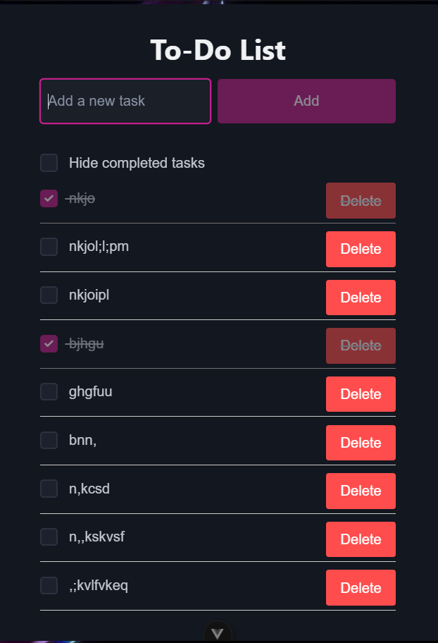

# Vue 3 To-Do List

This is a simple To-Do List application built with Vue.js 3. It allows users to add tasks, mark them as completed, hide completed tasks, and delete tasks.

## Features

- Add new tasks
- Mark tasks as completed with a checkbox
- Hide/show completed tasks with a toggle
- Delete tasks
- Simple and clean UI

## Screenshot

## Usage

1. Clone the repository or download the source code.
2. Install dependencies and run the Vue app using your preferred method (e.g., Vite, Vue CLI).
3. Open the app in your browser.
4. Add tasks, mark them completed, hide completed tasks, and delete tasks as needed.

## Technologies Used

- Vue.js 3 with `<script setup>` syntax
- Reactive state management with Vue's Composition API
- Basic CSS styling

---

*Note:* The screenshot above shows the app with tasks added, some marked completed, and the "Hide completed tasks" toggle.
